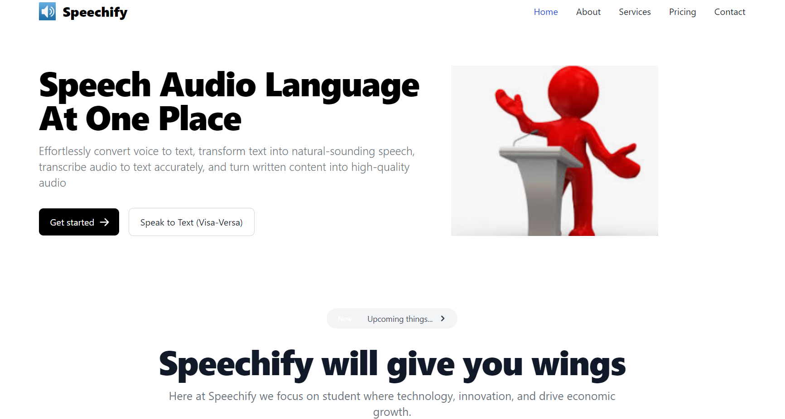
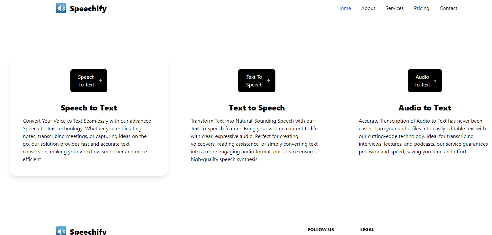
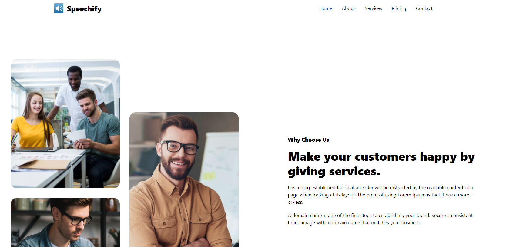
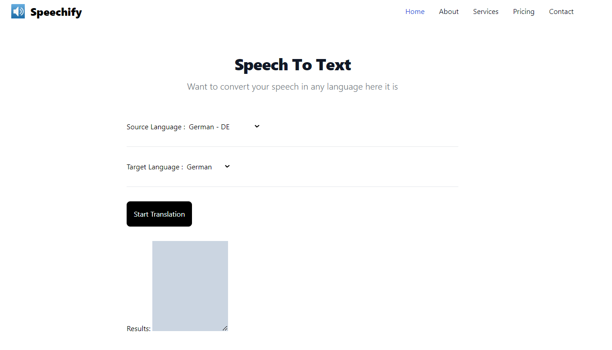
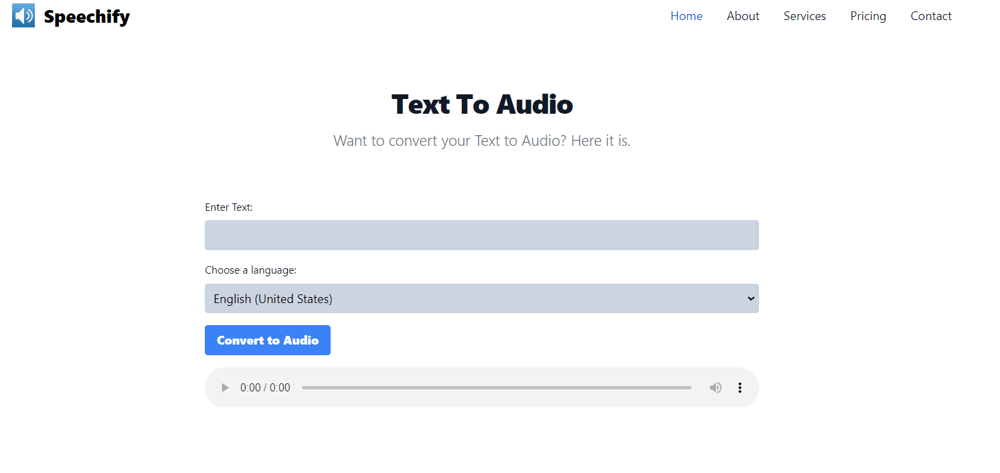
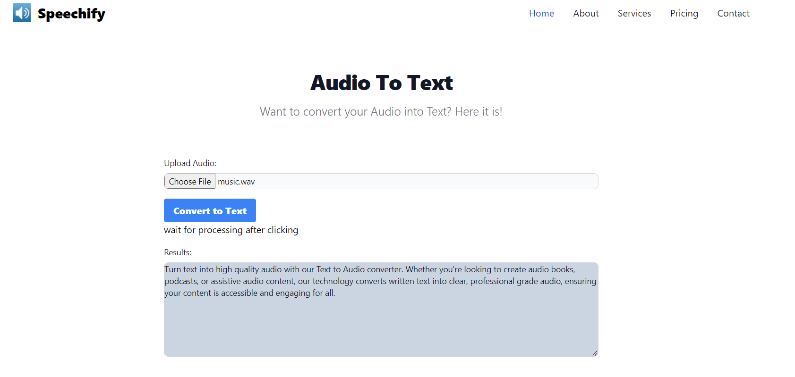

Microsoft Future Ready Talent Program
Project Title:
Speechify: Providing Translation, Audio Files, and More

Project Link:
[Insert Project Link Here]

Demo Video:
[Insert Demo Video Link Here]

Technologies Used:
Web Technologies: HTML, CSS, Tailwind CSS, JavaScript
IDE: Visual Studio Code
Primary Azure Technology:
Static Web Apps
Speech Services

Problem Statement:
The need for efficient and accurate translation between speech and text, and vice versa, is critical in a multilingual world. Existing solutions often fall short in terms of accuracy, speed, or accessibility.

Project Description:
Speechify is a versatile tool designed to bridge the gap between speech and text. Leveraging Azure's Speech Services, Speechify can:

Convert speech to text with high accuracy.
Translate text into various languages.
Convert text to speech, providing natural-sounding audio files.
Support multilingual communication by providing real-time translation.
Features:
Speech to Text: Easily convert spoken words into written text, supporting various languages.
Text to Speech: Convert written text into audio files, helping users listen to content in a natural voice.
Translation Services: Translate text from one language to another, supporting seamless communication.

Screenshots:

Here is the services : 
Speech to text : 

Text To Audio ":

Audio to Text : 

Conclusion:
Speechify aims to enhance accessibility and communication by providing a reliable platform for speech and text translation. By integrating cutting-edge Azure technologies, it ensures users have access to fast, accurate, and user-friendly tools for all their translation needs.

