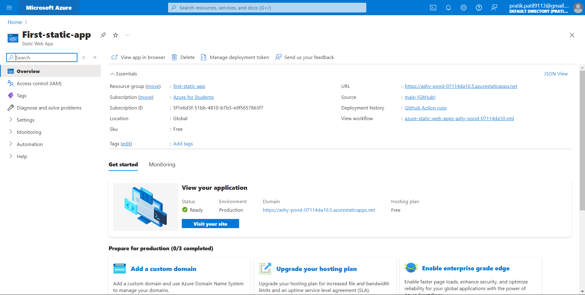

# Microsoft Future Ready Talent Program

## Project Title:
**Speechify: Providing Translation, Audio Files, and More**

### Project Link:
[https://ashy-pond-07114da10.5.azurestaticapps.net/]

### Demo Video:
[https://drive.google.com/file/d/1KDqhnO_R8TClXI9FloGVtbgeAG7bZI4G/view?usp=sharing]

### Technologies Used:
**Web Technologies:** HTML, CSS, Tailwind CSS, JavaScript
**IDE:** Visual Studio Code

**Primary Azure Technology:**
- Static Web Apps
- Speech Services

## Problem Statement:

The need for efficient and accurate translation between speech and text, and vice versa, is critical in a multilingual world. Existing solutions often fall short in terms of accuracy, speed, or accessibility.

## Project Description:
**Speechify** is a versatile tool designed to bridge the gap between speech and text. Leveraging Azure's Speech Services, Speechify can:
- Convert speech to text with high accuracy.
- Translate text into various languages.
- Convert text to speech, providing natural-sounding audio files.
- Support multilingual communication by providing real-time translation.

## Features:
1. **Speech to Text:** Easily convert spoken words into written text, supporting various languages.
2. **Text to Speech:** Convert written text into audio files, helping users listen to content in a natural voice.
3. **Translation Services:** Translate text from one language to another, supporting seamless communication.

## Screenshots:

## Azure Static Web Service 

## Azure Speech Service

## Azure Speech View 

### Speech to Text:

### Text to Audio:

### Audio to Text:

## Conclusion:
**Speechify** aims to enhance accessibility and communication by providing a reliable platform for speech and text translation. By integrating cutting-edge Azure technologies, it ensures users have access to fast, accurate, and user-friendly tools for all their translation needs.
